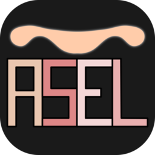

# Asel

## Presentation

**Asel** stands for "Another Scripting Language"... *Asel* is also a hebrew word (אסל) meaning "yoke" (1); I did choose that name as a reminder of the following word of Jesus:

> Take my yoke upon you and learn from me, for I am gentle and humble in heart, and you will find rest for your souls.

[Matthew 11. 29](https://biblehub.com/matthew/11-29.htm)

As much as a yoke can carry an image of pain, most of the programmng languages can sometimes feel like a burden, a yoke; and my goal with **Asel** is to create it with that idea in mind that this "yoke" can be easy to carry.

### Features

### Specifications

------------

## Installation

## Usage

## Documentation

## Contributing

-------

### Notes

(1) [Asel on Google Translate](https://translate.google.fr/?sl=iw&tl=en&text=%D7%90%D7%A1%D7%9C&op=translate)
